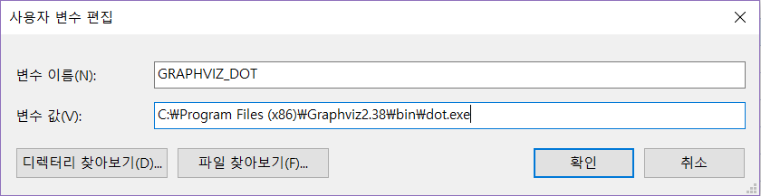
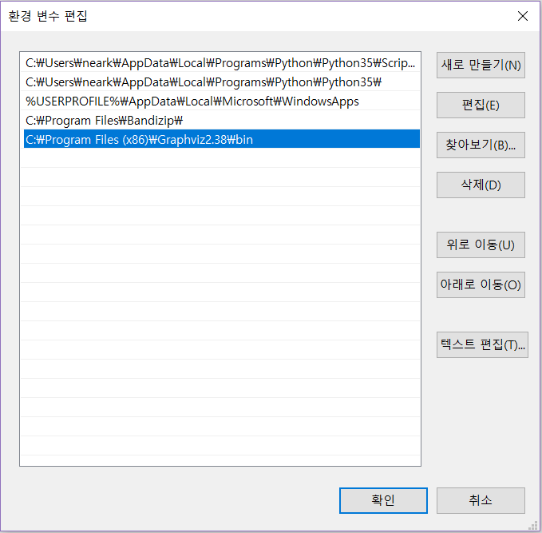

# PNU-AI-Study
부산대 인공지능 강의내용 및 과제 정리

## Errors
- graphviz가 정상적으로 설치되지 않았거나 경로가 설정되지 않은 경우
  + https://graphviz.gitlab.io/_pages/Download/Download_windows.html 에 접속하여 graphviz-2.38.msi 파일을 다운로드 받습니다. 
  + graphviz-2.38.msi을 실행시켜 graphviz를 설치합니다. 
  + 설치가 완료되면 제어판 > 시스템 및 보안 > 시스템 > 고급 시스템 설정 > 환경 변수에서 다음과 같이 변수를 추가합니다.

  

  

